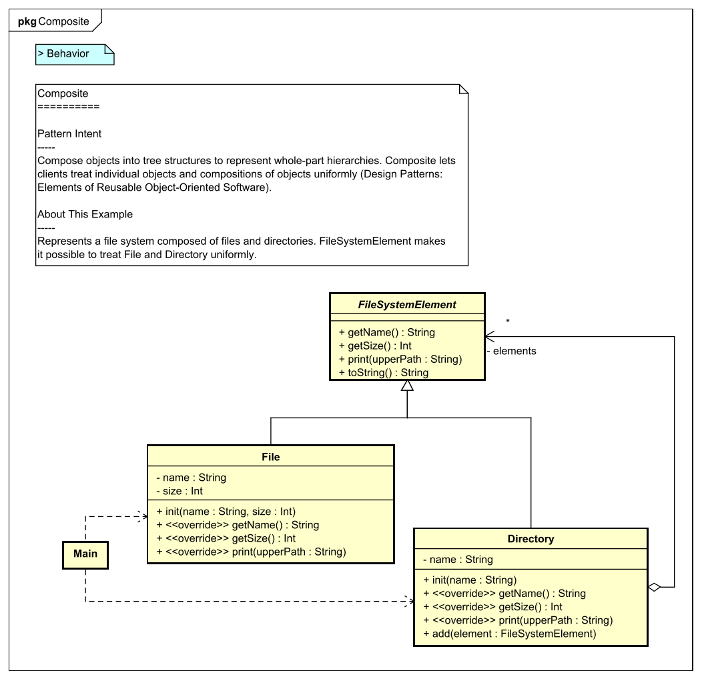

[](https://raw.githubusercontent.com/takaakit/design-pattern-examples-in-swift/master/screenshots/DiagramMap.svg)

Design Pattern Examples in Swift
===

Model and code examples of GoF Design Patterns for Swift.  
This project is available for the following objectives:  

* To understand GoF Design Pattern examples in Swift.
* To understand the mapping between UML model and Swift code.
* To try Model-Driven Development (MDD) using Astah and M PLUS plug-in.

> UML model example:



> Swift code example:

```swift
// ˅

// ˄

public class File: FileSystemElement {
    // ˅
    
    // ˄

    private let name: String

    private let size: Int

    public init(name: String, size: Int) {
        // ˅
        self.name = name
        self.size = size
        // ˄
    }

    // File name
    public override func getName() -> String {
        // ˅
        return name
        // ˄
    }

    // File size
    public override func getSize() -> Int {
        // ˅
        return size
        // ˄
    }

    // Print this element with the "upperPath".
    public override func print(upperPath: String) {
        // ˅
        Swift.print("\(upperPath)/\(self.toString())")
        // ˄
    }

    // ˅
    
    // ˄
}

// ˅

// ˄
```

Installation
------------
**Astah**
* Download Astah UML or Professional from [Change Vision site](http://astah.net/download), and install.  

**M PLUS plug-in**
* Download the plug-in from [M PLUS plug-in site](https://sites.google.com/view/m-plus-plugin/download), and install.  
  **Use ver.2.2 or higher.**

**Development Environment for Swift**
* Prepare a development environment for Swift (e.g. [Xcode](https://developer.apple.com/xcode/)).
* **Cocoa** framework is required. The operation has been confirmed in **Swift 4.1.2** and **Xcode 9.4.1**.

Usage
-----
* Select model elements on the model browser of Astah, and press the "Generate code" button to generate.  
* The generated code has "User Code Area". The "User Code Area" is the area enclosed by "˅" and "˄". Handwritten code written in the "User Code Area" remains after a re-generation.
* You can run the program from "main.swift" or "AppDelegate.swift" for each Design Pattern.
* For detailed usage of the tools, please see [Astah Manual](http://astah.net/manual) and [M PLUS plug-in Tips](https://sites.google.com/view/m-plus-plugin-tips).


References
----------
* Gamma, E. et al. Design Patterns: Elements of Reusable Object-Oriented Software, Addison-Wesley, 1994
* Hiroshi Yuki. Learning Design Patterns in Java [In Japanese Language], Softbank publishing, 2004

Licence
-------
This project is licensed under the Creative Commons Zero (CC0) license. The model and code are completely free to use.

[](http://creativecommons.org/publicdomain/zero/1.0/deed)
